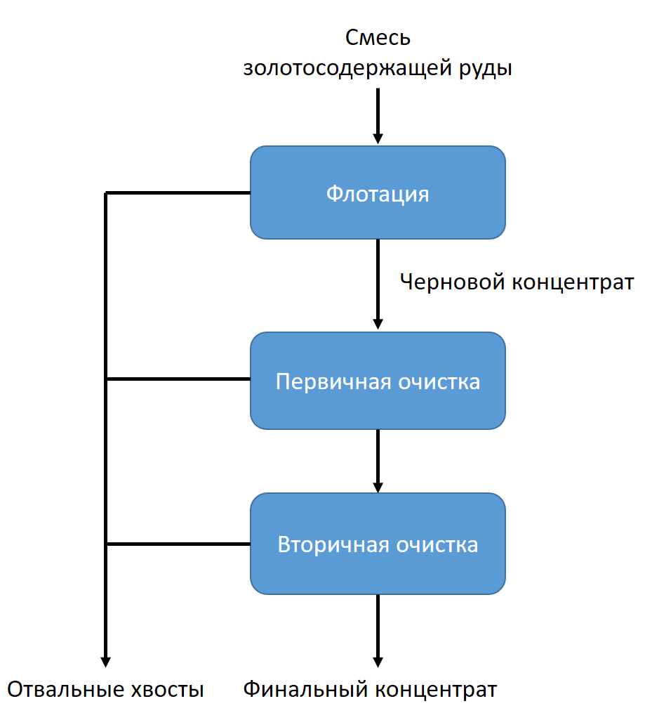

# Процесс очистки золота 

## Задача
Вы работаете в компании, занимающейся добычей и очисткой золота. В целях оптимизации производства было решено создать модель машинного обучения, которая будет предсказывать коэффициент восстановления золота из золотосодержащей руды (это снизит риск запуска убыточного предприятия). Для этого были собраны данные с параметрами добычи и очистки.

В процессе выполнения проекта необходимо:
- проверить корректность расчета коэффициента восстановления золота
- проанализировать параметры, недоступные в тестовой выборке
- провести предобработку данных
- провести исследовательский анализ данных, а именно:
    - оценить изменение концентрации металлов (Au, Ag, Pb) на различных этапах очистки
    - сравнить распределения размеров гранул сырья на обучающей и тестовой выборках
    - исследовать суммарную концентрацию веществ на разных стадиях очистки
- обучить несколько моделей, оптимизировать гиперпараметры, выбрать лучшую и проверить ее на тестовой выборке

Коэффициент восстановления золота рассчитывается по следующей формуле:

где: 
- C - доля золота в концентрате после флотации/очистки,
- F - доля золота в сырье/концентрате до флотации/очистки,
- T - доля золота в отвальных хвостах после флотации/очистки.

В качестве метрики качества использовать sMAPE (англ. Symmetric Mean Absolute Percentage Error, «симметричное среднее абсолютное процентное отклонение»), вычисляющееся по формуле:

где:
-  значение целевого признака для объекта с порядковым номером i,
-  значение предсказания для объекта с порядковым номером i,
- N - количество объектов.

Нужно предсказывать сразу две величины:
- эффективность обогащения после флотации *rougher.output.recovery*
- эффективность обогащения финального концентрата *final.output.recovery*

Итоговая метрика учитывает обе величины и вычисляется как:

## Технологический процесс
Технологический процесс состоит из флотации и двухэтапной очистки.

- На этапе флотации в установку подается смесь золотосодержащей руды. После обогащения получается черновой концентрат и остатки продукта с низкой концентрацией ценных металлов («отвальные хвосты»).

- После флотации черновой концентрат проходит два этапа очистки. На выходе получается финальный концентрат и новые отвальные хвосты.

## Данные
**Технологический процесс**:
- *Rougher feed* — исходное сырье
- *Rougher additions* — флотационные реагенты: 
    *Xanthate* — ксантогенат (промотер, или активатор флотации);
    *Sulphate* — сульфат (на данном производстве сульфид натрия);
    *Depressant* — депрессант (силикат натрия).
- *Rougher process* — флотация
- *Rougher tails* — отвальные хвосты
- *Float banks* — флотационная установка
- *Cleaner process* — очистка
- *Rougher Au* — черновой концентрат золота
- *Final Au* — финальный концентрат золота

**Параметры этапов**:
- *air amount* — объём воздуха
- *fluid levels* — уровень жидкости
- *feed size* — размер гранул сырья
- *feed rate* — скорость подачи

**Наименование признаков**:

должно быть в формате:
[этап].[тип_параметра].[название_параметра]

Возможные значения для блока [этап]:
- *rougher* — флотация
- *primary_cleaner* — первичная очистка
- *secondary_cleaner* — вторичная очистка
- *final* — финальные характеристики
Возможные значения для блока [тип_параметра]:
- *input* — параметры сырья
- *output* — параметры продукта
- *state* — параметры, характеризующие текущее состояние этапа
- *calculation* — расчётные характеристики

Данные находятся в трех файлах: в первом обучающая выборка, во втором тестовая выборка, в третьем исходные данные.

## Используемые библиотеки
*pandas*

*scikit-learn*

*numpy*

*seaborn*
